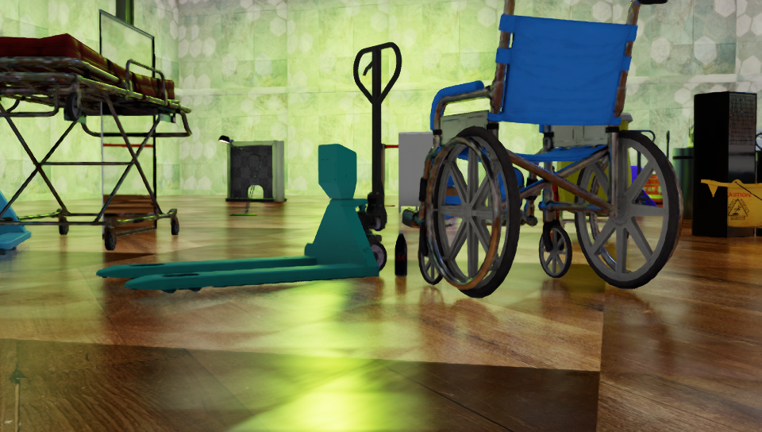
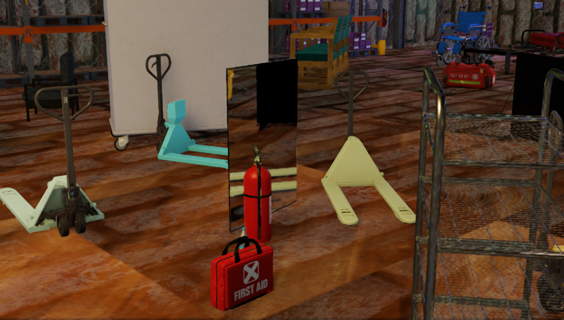
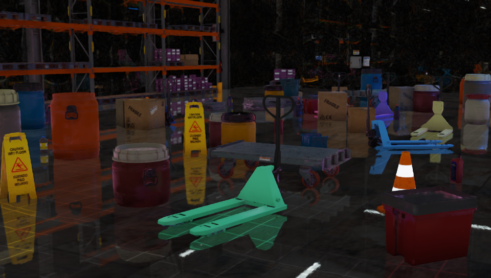
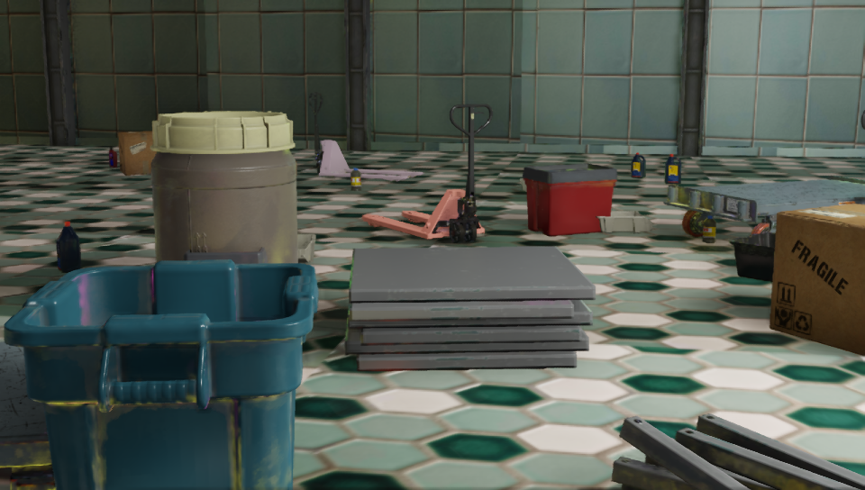
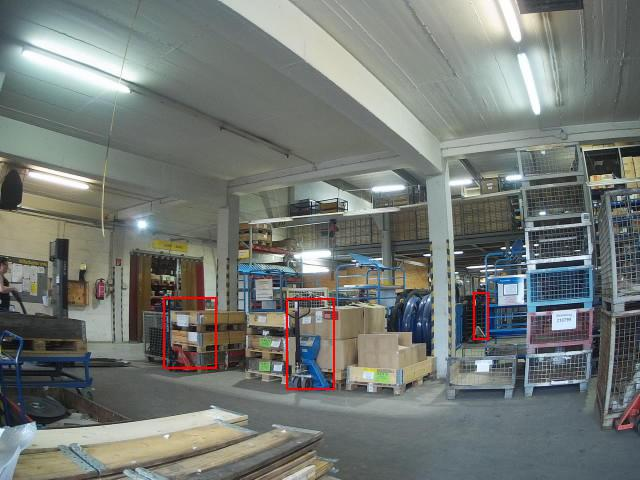
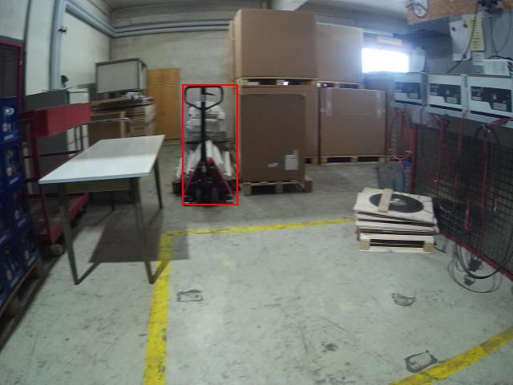
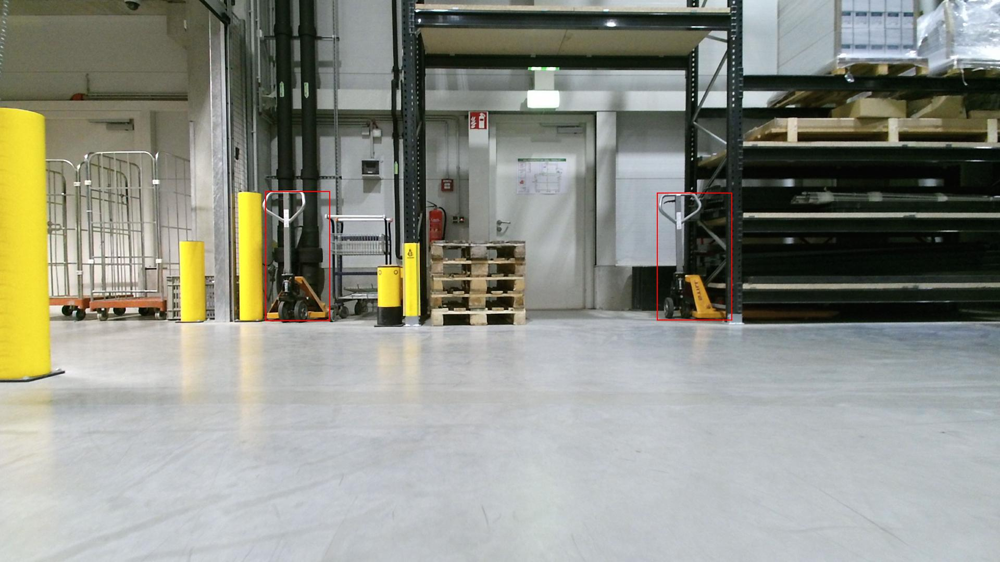
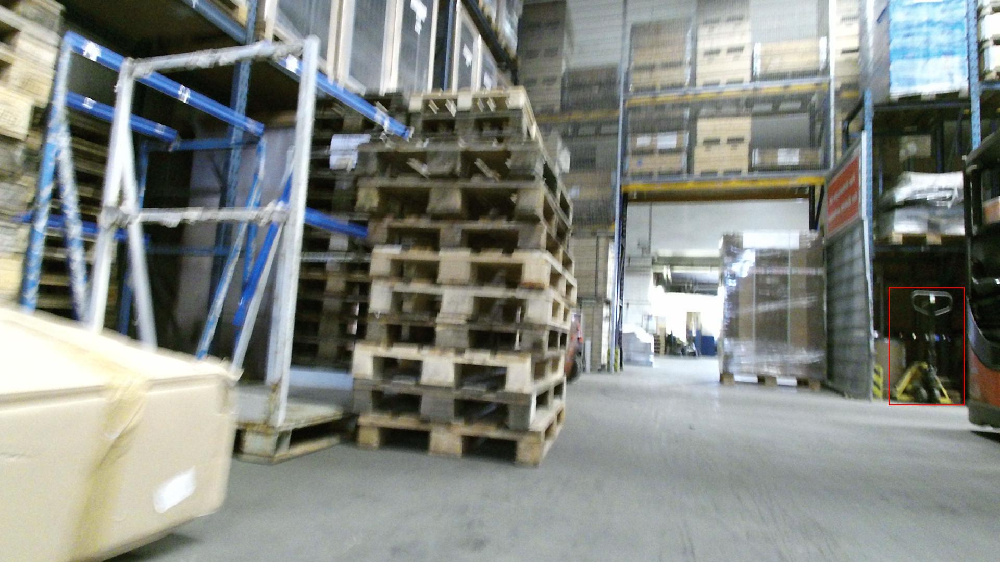
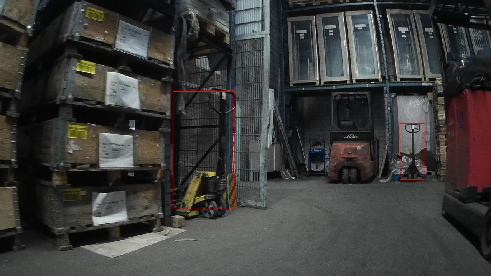
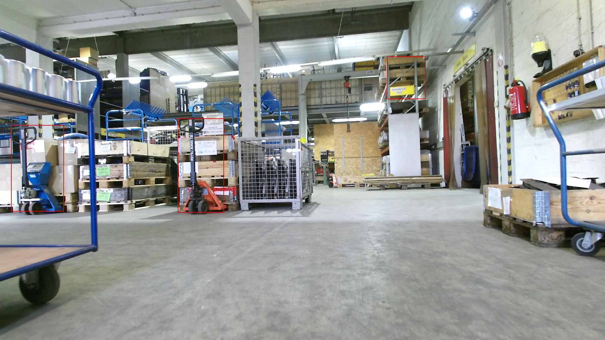

# Synthetic Data Generation and Training with Sim Ready Assets
This project provides a workflow for Training Computer Vision models with Synthetic Data. We will use Isaac Sim with Omniverse Replicator to generate data for our use case and objects of interest. To ensure seamless compatibility with model training, the data generated is in the KITTI format. 

These steps can be followed on a Cloud/remote GPU instance or locally

## How to use this repository
- [Guide](local/README.md) for running the workflow locally
- [Guide](cloud/README.md) for running on a cloud/remote instance

## Workflow Components:
* Generating Data: Use Isaac Sim to generate data
* Training: We will use TAO toolkit, however users can train a model in a framework of their choice with data generated

### SDG 
- Using the `palletjack` assets from the Warehouse Sim Ready Asset collection 

- Carry out Domain Randomization in the scene with Replicator:
    - Various attributes of the scene like lighting, textures, object pose and materials can be modified 
    - Important to generate a good quality dataset to ensure model detects objects in the real world

- Data output KITTI format
    - We will use the KITTI Writer for generating annotations
    - Possible to implement a custom writer (can be useful when data is expected in a certain format for your model)

- Sample generated images:

    
    

    
    

### Training
- TAO: Outline of steps 
    - Generating Tfrecords
     
    - Model training and evaluation
        - Model backbone selction
        - Hyperparameters specified via `spec` file (provided with repo) 
        - Running inference with trained model

- Sample real world detections on LOCO dataset images:

    
    

    
    

    
    

### Deployment
- Perform Optimizations: Pruning and QAT with TAO to reduce model size and improve performance
- Deploy on NVIDIA Jetson powered Robot with Isaac ROS or Deepstream 

## References:
- Real world images from the [LOCO dataset](https://github.com/tum-fml/loco) are used for visualizing   model performance
