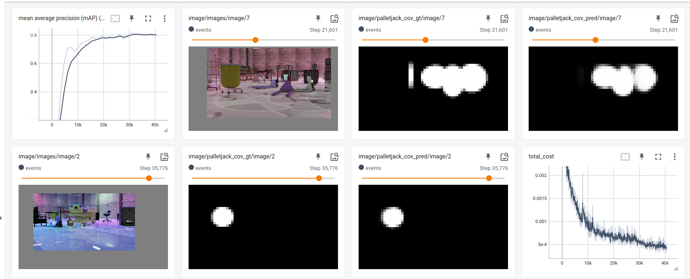

# Requirements
- Access to a cloud/remote GPU instance (workflow tested on a `g4dn` AWS EC2 instance with T4 GPU)
- Docker setup instructions are provided in the notebooks 
- Entire workflow can be run in `headless` mode (SDG script and training)

## Synthetic Data Generation
- Use the Isaac Sim docker container for running the Data Generation [script](../palletjack_sdg/palletjack_datagen.sh) 
- We will generate data for warehouse `palletjack` objects in KITTI format
- Follow the steps in the `cloud_sdg` notebook
- This generated data can be used to train your own model (framework and architecture of your choice), in this workflow we demonstrate using TAO for training

## Training with TAO Toolkit
- The `training/cloud_train` notebook provides a walkthrough of the steps:
    - Setting up TAO docker container
    - Downloading pre-trained model, we will use the `DetectNet_v2` model with a `resnet_18` backbone
    - Running TAO training with `spec` files provided
    - Visualizing model performance on real world data
- Visualize model metric with Tensorboard

## Next steps

### Generating Synthetic Data for your use case
- Make changes in the Domain Randomization under the Synthetic Data Generation [script](../palletjack_sdg/standalone_palletjack_sdg.py)
- Add additional objects of interest in the scene (similar to how palletjacks are added, you can add forklifts, ladders etc.) to generate dataUse different models for training with TAO (for object detection, you can use YOLO, SSD, EfficientDet) 
- Replicator provides Semantic Segmentation, Instance Segmentation, Depth and various other ground truth annotations along with RGB. You can also write your own ground truth annotator (eg: Pose Estimation: Refer to [sample](https://docs.omniverse.nvidia.com/isaacsim/latest/tutorial_replicator_offline_pose_estimation.html) These can be used for training a model of your own framework and choice)
- Exploring the option of using Synthetic + Real data for training a network. Can be particularly useful for generating more data around particular corner cases

### Deploying Trained Models
- The trained model can be pruned and optimized for inference with TAO
- This can then be deployed on a robot with NVIDIA Jetson