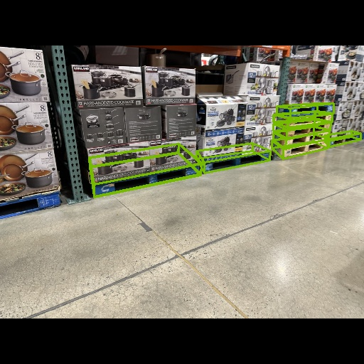

# SDG Pallet Model



This repository contains code for performing optimized TensorRT inference with a pre-trained
 pallet detection model that was trained using synthetic data with [NVIDIA Omniverse Replicator](https://developer.nvidia.com/omniverse/replicator).
 The model takes as input a monocular RGB image, and outputs the pallet box estimates.  The box esimates
are defined for each pallet side face.  So a single pallet may have multiple box
estimates.

If you have any questions, please feel free to reach out by opening an issue!

## Instructions

### Step 1 - Install dependencies

Assumes you've already set up your system with OpenCV, PyTorch and numpy.

Install einops for some utility functions.

```bash
pip3 install einops
```

Install [torch2trt](https://github.com/NVIDIA-AI-IOT/torch2trt).  This is used
for the ``TRTModule`` class which simplifies engine inference.

```bash
git clone https://github.com/NVIDIA-AI-IOT/torch2trt
cd torch2trt
python3 setup.py develop
```

### Step 2 - Download the ONNX model

Download the pallet model ONNX file.

| Model | Notes | Links |
|-------|-------|-------|
| pallet_model_v1_all | Trained for wood and other pallets (metal, plastic). | [onnx](https://drive.google.com/file/d/1Vsl7s5YhBFxkTkd3UYYgPWFCLNRm_O_Q/view?usp=share_link) |
| pallet_model_v1_wood | Trained only for wood pallets. | [onnx](https://drive.google.com/file/d/1Fd1gS7NYkWHPhUn7iZLK43hLQ1qDkuvb/view?usp=share_link) |


### Step 3 - Build the TensorRT engine


#### Option 1 (*recommended*) - Build the FP16 engine

To build the FP16 engine, call the following:

```bash
./build_trt_fp16.sh <onnx_path> <engine_output_path>
```


#### Option 2 - Build the INT8 engine

> The INT8 model instructions do not yet include calibration.  Please only use
> this model for throughput profiling.  The accuracy is likely to vary from
> FP32/FP16 models.  However, once calibration is included, this may become
> the recommended option given the improved throughput results.

To build the INT8 engine, call the following:

```bash
./build_trt_int8.sh <onnx_path> <engine_output_path>
```

We hope to provide instructions for using the Deep Learning Accelerator (DLA)
on Jetson AGX Orin, and INT8 calibration soon.

### Step 3 - Profile the engine

To profile the engine with the ``trtexec`` tool, call the following:

```bash
./profile_engine.sh <engine_path>
```

Here are the results for a model inference at 256x256 resolution,
profiled on Jetson AGX Orin.

<a id="throughput_results"/>

| Precision | Throughput (FPS) |
|-----------|------------------|
| FP16      | 465              |
| INT8      | 710              |

Notes:

- Called ``jetson_clocks`` before running
- Using MAXN power mode by calling ``sudo nvpmodel -m0``
- Batch size 1
- ``--useSpinWait`` flag enabled to stabilize timings
- ``--useCudaGraph`` flag enabled to use CUDA graph optimizations.  Cuda graph
  isn't yet used in the predict function.

### Step 4 - Run inference on an example image.


```bash
python3 predict.py <engine_path> <image_path> --output=<output_path>
```

For more options

```
python3 predict.py --help
```

### Next Steps

Try modifying the predict.py code to visualize inference on a live camera feed.
